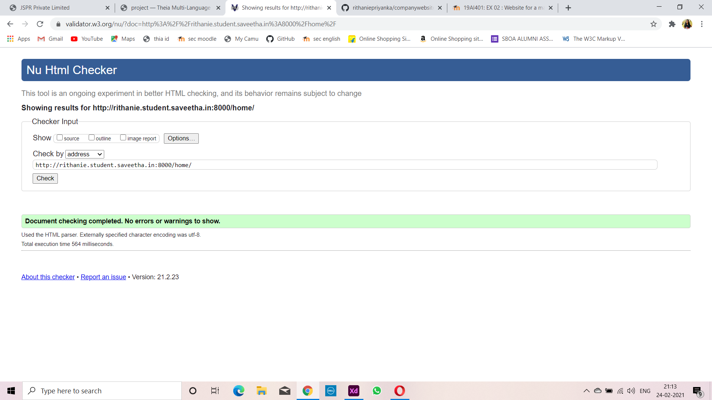

# Web Design for a Manufacturing Company
## AIM: 
To design a static website for a chip manufacturing company.

## DESIGN STEPS:
### Step 1: 
Requirement collection.
### Step 2:
Creating the layout using HTML and CSS.
### Step 3:
Updating the sample content.
### Step 4:
Choose the appropriate style and color scheme.
### Step 5:
Validate the layout in various browsers.
### Step 6:
Validate the HTML code.
### Step 6:
Publish the website in the given URL.

## PROGRAM:

### base.html
```

<!DOCTYPE html>
<html lang="en">

<head>
    <title>JSPR Private Limited</title>
    <link rel="stylesheet" href="">
    <link rel = "icon" href ="" type = "image/x-icon"> 
              
</head>

<body>
    <div class="container">
    <div class="banner">
        JSPR Private Limited.
    </div>
    <div class="menu">
        <div class="menuitem"><a href="/home">Home</a></div> 
        <div class="menuitem"><a href="/products">Products</a></div> 
        <div class="menuitem"><a href="/people">People</a></div>
        <div class="menuitem"><a href="/contactus">Contact Us</a></div> 
    </div><div class="content">
        
    
    </div>
    <div class="footer">
        Copyright © 2020 JSPR Private Limited, Developed by Rithaniepriyanka.
    </div>
    </div>
</body>

</html>
```

### home.html
```



    <div class="homecontent">    
    <h1>About Us</h1>
    
    <div class="contenttext">
    JSPR Pvt Ltd, provides a broad range of semiconductor and infrastructure software applications that serve the data center, networking, software, broadband, wireless, and storage and industrial markets. Common applications for its products include: data center networking, home connectivity, broadband access, telecommunications equipment, smartphones, base stations, data center servers and storage, factory automation, power generation and alternative energy systems, displays, and mainframe operations and management, and application software development. Some of Silicon's core technologies and products include:
    <ul>
        <li>Memory Chips</li>
        <li>SATA HDD</li>
        <li>SATA SSD </li>
        <li>Broadband Modems</li>
        <li>Wifi Devices</li>
        <li>Switching Devices</li>
        <li>Optical Sensors</li>
    </ul> 
    </div>
    </div>

```
### products.html
```



    <div class="productcontent">    
    <h1>Our Premium Products</h1>
    <div class="productitems">
        <div class="productitem"> 
            <div class="itemimage">
            
            </div>
            <div class="itemname">4GB DDRA4 laptop memory</div>
            <div class="itemprice">Price: Rs.2000.00 </div>
        </div>
        <div class="productitem"> 
            <div class="itemimage">
            
            </div>
            <div class="itemname">1TB Laptop HDD</div>
            <div class="itemprice">Price: Rs.5000.00 </div>
        </div>
        <div class="productitem"> 
            <div class="itemimage">
            
            </div>
            <div class="itemname">650IN Wireless N300 Router</div>
            <div class="itemprice">Price: Rs.1999.00 </div>
        </div>
         <div class="productitem"> 
            <div class="itemimage">
            
            </div>
            <div class="itemname">N150 Wireless Network Adapter for Desktop</div>
            <div class="itemprice">Price: Rs.499.00 </div>
        </div>
        <div class="productitem"> 
            <div class="itemimage">
            
            </div>
            <div class="itemname">WiFi Socket Switch Plug for<br/>LDR light sensor module for DIY</div>
            <div class="itemprice">Price: Rs.2999.00 </div>
        </div>
        <div class="productitem"> 
            <div class="itemimage">
            
            </div>
            <div class="itemname">LM393 Optical Photosensitive<br/> smart devices</div>
            <div class="itemprice">Price: Rs.350.00 </div>
        </div>
        <div class="productitem"> 
            <div class="itemimage">
            
            </div>
            <div class="itemname">Memory chip<br/> 16GB</div>
            <div class="itemprice">Price: Rs.299.00 </div>
        </div>
        <div class="productitem"> 
            <div class="itemimage">
            
            </div>
            <div class="itemname">REES52 GP2Y1010AU0F Compact Optical<br/>Dust Sensor Smoke Particle Sensor</div>
            <div class="itemprice">Price: Rs.599.00 </div>
        </div>
        <div class="productitem"> 
            <div class="itemimage">
            
            </div>
            <div class="itemname">WiFi Display Dongle | DLNA Airplay | Wireless<br/> HDMI HD Screen Mirroring WiFi Adaptor</div>
            <div class="itemprice">Price: Rs.1899.00 </div>
        </div>
        <div class="productitem"> 
            <div class="itemimage">
            
            </div>
            <div class="itemname">Toshiba 500 GB 2.5" Inch<br/>Laptop SATA Internal Hard Disk Drive</div>
            <div class="itemprice">Price: Rs.2500.00 </div>
        </div>
        <div class="productitem"> 
            <div class="itemimage">
            
            </div>
            <div class="itemname">15cm 4Pin Molex to SATA Power Cable<br/>Adapter for Internal Hard Disk Drive, HDD, SSD & DVD Writer<br/>(Pack of 2 Pieces)</div>
            <div class="itemprice">Price: Rs.200.00 </div>
        </div>
        <div class="productitem"> 
            <div class="itemimage">
            
            </div>
            <div class="itemname">W1209 50~100 digital<br/>temperature controller thermostat</div>
            <div class="itemprice">Price: Rs.300.00 </div>
        </div>
    </div>
    </div>

```
### people
```



    <div class="peoplecontent">
    <h1>MEET OUR TEAM</h1>
    <div class="peopleitems">
        <div class="peopleitem"> 
            <div class="peopleimage">
            
            </div>
            <div class="peoplename">RITHANIEPRIYANKA</div>
            <div class="peopledesig">Director</div>
        </div>
        <div class="peopleitem"> 
            <div class="peopleimage">
            
            </div>
            <div class="peoplename">KATNISS EVER</div>
            <div class="peopledesig">Managing Director</div>
        </div>
        <div class="peopleitem"> 
            <div class="peopleimage">
            
            </div>
            <div class="peoplename">EMMA WATSON</div>
            <div class="peopledesig">Asst.Managing Director</div>
        </div>
        <div class="peopleitem"> 
            <div class="peopleimage">
            
            </div>
            <div class="peoplename">NATASHA</div>
            <div class="peopledesig">Team Leader</div>
        </div>
        <div class="peopleitem"> 
            <div class="peopleimage">
            
            </div>
            <div class="peoplename">CHIKI</div>
            <div class="peopledesig">Team Leader</div>
        </div>
        <div class="peopleitem"> 
            <div class="peopleimage">
            
            </div>
            <div class="peoplename">NISABA</div>
            <div class="peopledesig">Team Leader</div>
        </div>
    </div>
    </div>

```

### contactus
```


<form action="//submit.form" id="ContactUs100" method="post" onsubmit="return ValidateForm(this);">
<script type="text/javascript">
function ValidateForm(frm) {
if (frm.Name.value == "") { alert('Name is required.'); frm.Name.focus(); return false; }
if (frm.FromEmailAddress.value == "") { alert('Email address is required.'); frm.FromEmailAddress.focus(); return false; }
if (frm.FromEmailAddress.value.indexOf("@") < 1 || frm.FromEmailAddress.value.indexOf(".") < 1) { alert('Please enter a valid email address.'); frm.FromEmailAddress.focus(); return false; }
if (frm.Comments.value == "") { alert('Please enter comments or questions.'); frm.Comments.focus(); return false; }
return true; }
</script>
<table style="width:100%;max-width:550px;border:0;" cellpadding="8" cellspacing="0">
<tr> <td>
<label for="Name">Name*:</label>
</td> <td>
<input name="Name" type="text" maxlength="60" style="width:100%;max-width:250px;" />
</td> </tr> <tr> <td>
<label for="PhoneNumber">Phone number:</label>
</td> <td>
<input name="PhoneNumber" type="text" maxlength="43" style="width:100%;max-width:250px;" />
</td> </tr> <tr> <td>
<label for="FromEmailAddress">Email address*:</label>
</td> <td>
<input name="FromEmailAddress" type="text" maxlength="90" style="width:100%;max-width:250px;" />
</td> </tr> <tr> <td>
<label for="Comments">Comments*:</label>
</td> <td>
<textarea name="Comments" rows="7" cols="40" style="width:100%;max-width:350px;"></textarea>
</td> </tr> <tr> <td>
* - required fields
</td> <td>
<input name="skip_Submit" type="submit" value="Submit" />
</td> </tr>
</table>
</form>

```
## OUTPUT:


## CODE VALIDATION REPORT:



## RESULT:
Thus a website is designed for the chip manufacturing company and is hosted in the URL http://rithanie.student.saveetha.in:8000/. HTML code is validated.